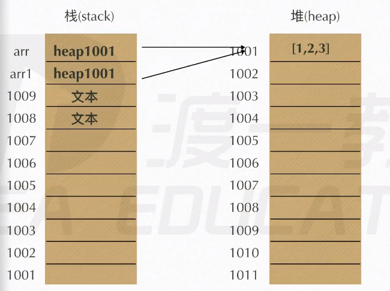

# 数据类型
js 数据类型分为 原始值 和 引用值

## 原始值
Number Boolean String undefined null
```js
var a = 10
var b = a
a = 11
console.log(b);
```

存储在 Stack 中


## 引用值
array Object function ...date RegExp
```js
var arr = [1]
var arr1 = arr
arr.push(2)
console.log(arr1);
```

存储在 heap 中




# 运算符

## +
数学运算、字符串连接

## /
1 / 0 返回 Infinity，无限的

```js
1 / 0
-1 / 0
```

## ++ --

```js
var a = 10
a = a + 1

// 等价于 a++
a++

console.log(a++);   // 先跑 log, 后加
console.log(a);

console.log(++a);   // 先跑++，后跑 log
```

赋值的顺序  自由向左，计算的顺序  自左向右

```js
var a = 10
var b = ++a - 1 + a++;
console.log(b);
```


任何数据类型加字符串都等于字符串


# 兼容
```js
div.onClick = function (e) {
	var event = e || window.event
}


var score  = window.prompt('input')
```


# 条件语句
```js
var score = 101
if (90 < score < 100) {
	console.log('生而为人，我很抱歉');
}

```
** 上面的语句，if 条件是满足的。 score 先和 90 比较返回 true，然后 true 和 100 去比较返回 true，if 条件满足 **

试一波 python
```python
score = 101
if 90 < score < 100:
    print("生而为人，我很抱歉")
```
不会 print......

这是 js 特有之坑爹吗???

```js
for (var i = 0; i < 10; i++) {
	console.log('a');
}
var i = 100
for (;i--;) {
	console.log(i);
}
```
while 底层机制 for 循环...


```js
var n = 3
switch (n) {
	case 1:
		console.log('a');
		break;
	case 2:
		console.log('b');
		break;
	case 3:
		console.log('c');
		break;
	default:
		0
}
```

# 类型

## typeof

```js
typeof '123'
typeof 123
typeof true
typeof {a:10}
typeof q
var a = ()=>{}
typeof a
typeof(123)
typeof(a)
```

## 类型转换
```js
var a = '1' - 1
console.log(a);
var b = '2' - '1'
console.log(b);
```

```js
var num = Number('123')
num = Number('123.9')
typeof(num)
num = Number(true)
num = Number(false)
num = Number('-123')
num.toString()
num = Number('a')
num = Number('abc')
num = Number(undefined)
num.toString()
num = parseInt(true)
num = parseInt('a')
num = parseInt('-123')
num = parseInt('123.9')
num = parseFloat('123.9')
isNaN(null)
```


# 字面量和构造函数
```js
function Student(name, sex, age){
	this.name = name
	this.sex = sex
	this.age = age
	return this    // 隐式返回，默认的
}
var student = new Student('zhangsan', 18, 'male')
console.log(new Student('a', 'a', 10).sex);
student
delete student
student

var arr = [1, 2, 3, 4]
arr.length = 2
arr
delete arr
arr.length
brr = [1, 2]
delete brr
brr
```

# 原型链
```js
var a = 'abcd'
a[2]
a.charCodeAt(2)    // 取 ord

```

原型是 function 对象的一个属性，通过构造函数产生的对象，可继承该原型的属性和方法。原型也是对象。

```js
function Person(){
	return this    // 隐式返回，默认的
}
Person.prototype.name = 'hehe'
var person = new Person()
person
person.name
Person.prototype.age = 18
person.age
Person.prototype

person.constructor

function Car(){
}
Car.prototype = {
	// constructor : Person
}
var car = new Car()
car.constructor
var obj = {
	name: 'sunny'
}
var person2 = new Person()
person2.__proto__ = obj
person
person.name

```
constructor 返回构造函数，类似 python 的 super 或 mro 找自己的父类！！

js 中也有私有属性，和 python 一样。

__proto__: 连接关系，一级一级找上去.  __mro__


```js
Person.prototype.name = 'sunny'
function Person() {
	// var this = {__proto__: Person.prototype}  // 现在的 __proto__ 等于 prototype
}
var person = new Person()
Person.prototype = {     // 将 prototype 改了，但 __proto__ 没变！！！
	name: 'cherry'
}
person.name
```


```js
var obj = Object.create(null)    // 原型。 不在继承 Object.prototype
obj
```


## call 和 apply 改变 this 指向

```js
function Person(name, age, sex) {
	this.name = name
	this.age = age
	this.sex = sex
}
function Student(name, age, sex, tel, grade) {
	Person.call(this, name, age, sex)
	this.tel = tel
	this.grade = grade
	// Person.apply(this, [name, age, sex])
}
```

apply 第一个 this，后面收个数组
